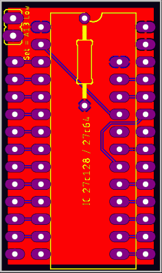

# 23c64-to-27c64_128-adapter
A 23C64 ROM to 27C64/27C128 adapter

Meaning you can add a 27C64 or 27C128 eprom to the adapter, and plug the adapter into one of the rom sockets of i.e. the C64, C128 etc.

To use a 27C64, you only need a 28pin socket and 2 x 12pin male/male sil headers, preferably turned/tulip style.

To use a 27C128, you need a 4k7 - 10k ohm resistor, a wire with a 2 way switch connected to the 2 pin header. This will make you able to switch between 2 rom files (each 8kB) in the 16kB eprom.

You can also use this pcb to create an adapter to read the ROM chips in the C64, simply add 2x14pin male/male sil headers in the bottom instead of the 28pin rom socket. and 24pin rom socket on top instead of the 2x12 pin sil headers in the bottom.

